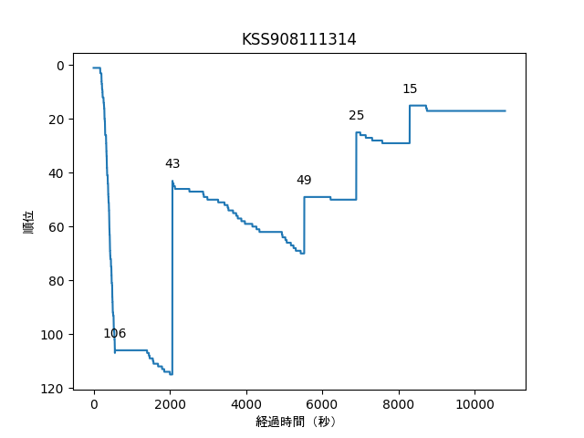

:::note
この記事は 2023年7月16日 に[はてなブログ](https://shogo314.hatenablog.com/entry/2023/07/16/002904)で公開した記事の転載です。
:::

ICPC2023国内予選にチームKSS908111314で参加し、17位で予選通過しました。

## チーム

メンバーは[hint908](https://atcoder.jp/users/hint908)、[sakasu1](https://atcoder.jp/users/sakasu1)、[shogo314](https://atcoder.jp/users/shogo314)（自分）。出場時のAtCoderレートはそれぞれ2039、1630、1626。阪大の3軍にあたる。チーム名はメンバーの名前から。

## 前日以前

チーム練とかは特になかった（エンジョイ勢なので）。jagは出てもいいかと思ったが、私は用事があったので提案せず。

kurehaに圧力をかけておくの図。

> kurehaさんにCDEを解いてもらえばいいのか <https://t.co/IEWWeQvMBO>
>
> — shogo314 (@shogo3142) [2023年6月27日](https://twitter.com/shogo3142/status/1673517207664619522?ref_src=twsrc%5Etfw)

## 当日

### 12:00～16:30

自分は12時過ぎに会場入り。13時くらいには全員揃っていた。

14時頃、kurehaのパソコンがなぜかWifiに接続出来なかったので、急遽私のパソコンを使うことになる。全員練習問題を提出して実行方法を確認。

誰がどの問題を解くかを事前に簡単に決めておく。とりあえず全員1つずつ通せばいいだろうということで、Aはじゃんけんに勝ったsakasu、Bはshogoが担当することになる。

### 16:30～16:40

sakasuがAを解く。ちょっと詰まって9:21にAC。

sakasu「ごめーん」

### 16:40～17:05

shogoがBを解く。交代した時点で問題を読み終わっておらず、少し時間がかかって34:28にAC。

O(nm)で書いたが、O(n^2m^2)で書いた方が速かったかも。

### 17:05～17:30

kurehaはCをsakasuに投げて、DとEの考察。Dは高々7なので6以下になる場合を考えれば良い。

sakasuがCのコードを書くが出力がおかしい。

shogoはDとEを考えるがいいアイデアは浮かばず。

kurehaがEを書けそうというのでCのコードを印刷して交代。

### 17:30〜17:55

kurehaがEのコードを書く。

sakasuはCのデバッグ。

kurehaが一旦考察を整理したそうだったので、Cと交代を提案。

### 17:55〜18:03

sakasuCのコードを修正（添字を一個ミスってた）。1:32:10にCをAC。

### 18:03〜18:25

kurehaがEのコードの続きを書く。1:54:55にEをAC。

shogoはDを数に大小をつけて、適切に打ち切れば、十分短い時間で6つの数の全通りを試せることを証明。

### 18:25〜18:49

素直に5重for文を書くことを提案。

kurehaがDのコードをbitsetでいい感じに書く。

2:18:17にDを提出。

### 18:49〜19:30

3チーム進出条件の25位以内は十分達成しているだろうと思い、順位表を見に行く。15位、阪大内1位で驚く。FとGを解く気にならないので、順位表を眺める。

FとGの問題を見に行く。順位表を見る限り、難易度に差はあまりなさそう。

Fは書く気にならず。

> ICPCのF  
> shogo「いい感じに変形したやつが凸多角形かで出来そうです？」  
> kureha「はい。私は書きたくないです。」  
> shogo「私もです...」
>
> — shogo314 (@shogo3142) [2023年7月7日](https://twitter.com/shogo3142/status/1677320292065050629?ref_src=twsrc%5Etfw)

Gはn≦60、m≦60という制約で何が出来るのか全くわからず。

Eの解法をkurehaに教えてもらったり、順位表を眺めたりして、時間を潰す。

shogo「mijingiriが4完だったら煽りに行こう」

### 時刻ごとの順位

表示してみるとおもしろいかと思ったが、よくある感じかも。

[（グラフを表示するコード）](https://github.com/shogo314/icpc_replay_python)

## 感想

国内予選通過への貢献としてはEを解いたkurehaがかなり偉い。Cを書いたsakasuも偉い。

ライブラリを印刷していなかったが、持ち込んでおけばFを書く気になったかも。

3人とも、国内予選通過は初（自分以外は国内予選自体初）なので不安もあるが楽しみ。
