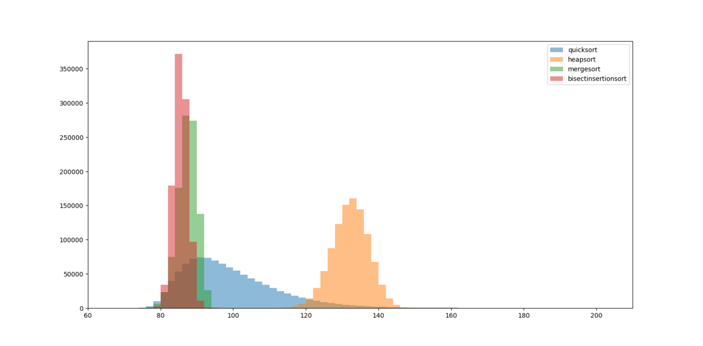

:::note
この記事は 2023年10月22日 に[はてなブログ](https://shogo314.hatenablog.com/entry/2023/10/22/195246)で公開した記事の転載です。
:::

AtCoder Heuristic Contest 025に参加し、185位でした。

## やったこと（時系列）

### 適当に原型を作る

```
d[i] = i % D
```

とする。
<https://atcoder.jp/contests/ahc025/submissions/46619584>

> AHCの順位表は作戦立てに有効な情報が多いので視覚的に把握できると便利です  
> 例えば今日開催されたAHC024では現時点(10/13, 12:54)では10位付近に強い貪欲があるのがわかります。 [pic.twitter.com/ndFWFVUZff](https://t.co/ndFWFVUZff)
>
> — pitP (@HISHO\_NO\_KISEKI) [2023年10月14日](https://twitter.com/HISHO_NO_KISEKI/status/1713039980036329955?ref_src=twsrc%5Etfw)

上の並んでいる部分。みんな考えることは同じやね。

### 考える

原型を改良する方向で考える。Dが大きいときは、ソートして最小と最大を近づければそれっぽくなりそう。

$$
2 \le D \le 25,
$$

$$
8D \le Q \le 1600D,
$$

Qが最小のときでもギリギリ、ソート出来そう。

#### ソートの比較

ソートの候補は

- マージソート
- クイックソート
- ヒープソート
- 二分挿入ソート

要素数25（一致する数字はなし）で、それぞれ10<sup>6</sup>回実行したときの比較回数。


二分挿入ソートは挿入ソートの挿入位置を二分探索で求めるもの。通常、挿入コストが重いので使われないが、比較コストはこの中で最も低いようだ。

最悪でも要素数の4倍未満なので必ずソート出来る。

```python
N = 25
t = 0
for i in range(1, N):
    t += i.bit_length()
print(t) # 94
```

最悪の比較回数は上のコードで求まる。

#### 大小関係の保存

Qが小さいのでちゃんと最適な質問の仕方をしたい。

$$
x \le y \land y \le z \to x \le z
$$

$$
\operatorname{Weight} \{ a \} \le \operatorname{Weight} \{ b \} \leftrightarrow \operatorname{Weight} \{ a,c \} \le \operatorname{Weight} \{ b,c \}
$$

みたいな性質は使いたい。

### ソートしたあと上と下を近づける

大小関係についてきちんと保存して、上記の性質を利用して無駄なクエリを排除するコードを書いてみたものの、うまく動かなかったので、実装コストの軽い方針で進める。
はじめに二分挿入ソートでソートしたあと、要素が2つ以上のなるべく大きいグループからランダムに1つ選び、最も小さいグループに移動させる。これで改善する場合は採用し、新しいグループの挿入位置を二分探索で調べる。

提出
<https://atcoder.jp/contests/ahc025/submissions/46724103>

結構いいスコア

### 繰り返す

上の方法では最も大きいグループのどれを移動させても改善しない状態に収束するので、収束が確認できたら初期解をランダムに作成し同じ操作をする。新しく作った解の最大最小のグループを元の解のものと比べて、どちらも改善しているなら採用する

提出
[Submission #46742799 - AtCoder Heuristic Contest 025](https://atcoder.jp/contests/ahc025/submissions/46742799)

収束するまでの操作は回しきれないものから30回程のものまである

### D=2のときについて考えてみる

シード0~999の1000ケースについて`--D=2`で実験してみたところスコアの平均は31858.2だった。

解の探索範囲を広げるため、大きい方から小さい方に動かして悪化する場合もそれを採用することにした。スコアの平均は57360.4だった。
悪化する場合は選択せずに選び直すという処理はよかったようだ。

単に2つを比べて近づけていくのはあんまり賢くない気がするが特によい方法が思いつかない。

問題の都合上、少し改善が難しい。力を出し切った感覚はないが、十分なスコアは出ていそうだし、疲れたのでここで終了。結局3回しか提出しなかった。
