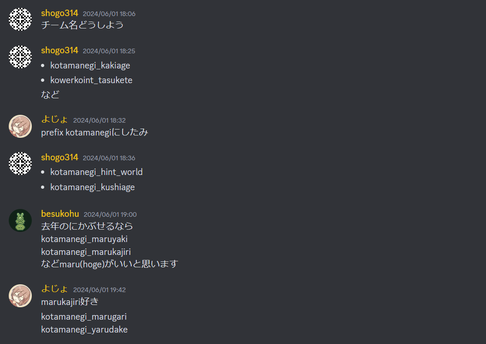

:::note
この記事は 2024年7月6日 に[はてなブログ](https://shogo314.hatenablog.com/entry/2024/07/06/002838)で公開した記事の転載です。
:::

### チーム

メンバーは[shogo314](https://atcoder.jp/users/shogo314)（自分）、[besukohu](https://atcoder.jp/users/besukohu)、[littlegirl112](https://atcoder.jp/users/littlegirl112)です。出場時のAtCoderのレートはそれぞれ1848, 1902, 1805でした。今年も阪大の3軍です。阪大ではざっくりレート順に決まるチームが多いです。

### チーム名

kotamanegi\_marukajiriになりました。

### JAG

いくつかのチームで集まって参加しました。結果は27位でした。力を出せなかったわけではありませんが、一昨年の基準では通過できない基準。なかなか厳しいです。

### 当日

早めに行って設営を手伝ったりしました。

### 本番

#### A

考察: littlegirl112
実装: shogo314
言われたとおりに実装しました。

AC 2:25

#### B

考察: littlegirl112
実装: shogo314
言われたとおりに実装しました。

AC 6:34

#### C

考察: besukohu
実装: shogo314
言われたとおりにO(1)を書いたけど、嘘でした。何回か書き直して、駄目だったので、littlegirl112に見てもらいながら前計算で中心からBFSするのを書きました。
バグらせて大変でした。

AC 34:04

#### D

考察: littlegirl112
実装: shogo314
言われたとおりに実装しました。
バグらせながらなんとかACしました。

AC 1:08:22

#### E

考察: littlegirl112, besukohu
実装: littlegirl112
嘘を書いたり、嘘じゃなかったかもだったり。
僕はほとんど関わっていません。サンプルは通ったけど絶対WAですと言われたので、とりあえず出しましょうとだけ言いました。

ACならず

#### F

考察: besukohu
実装: shogo314
頑張りました。頑張ったのですが実装しきれませんでした。少し理解の浅い部分もありました。

ACならず

### 感想

調子がかなり良ければ6完の可能性が見えてくるけど、正直難しかったです。最後の方はlittlegirl112とパソコンの取り合いをしていましたが、6完する必要があったので、そのムーブは間違っていなかったと思っています。双子が11位な時点で魔境コンテストだったと思います。

来年は僕が院試に落ちていなければ1軍か2軍で出場しているはずです。がんばります。
