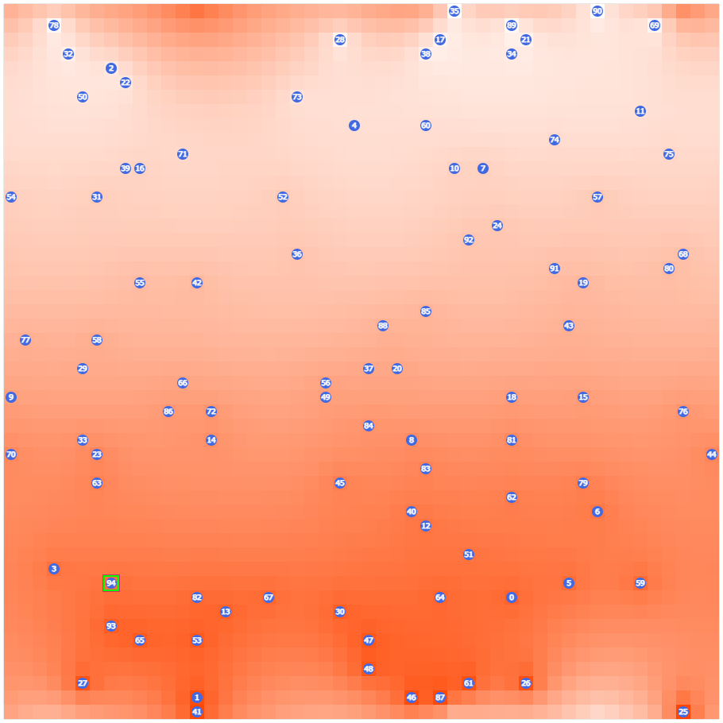
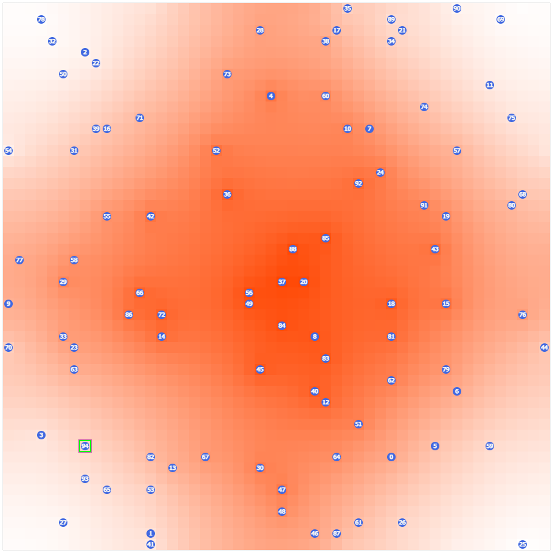
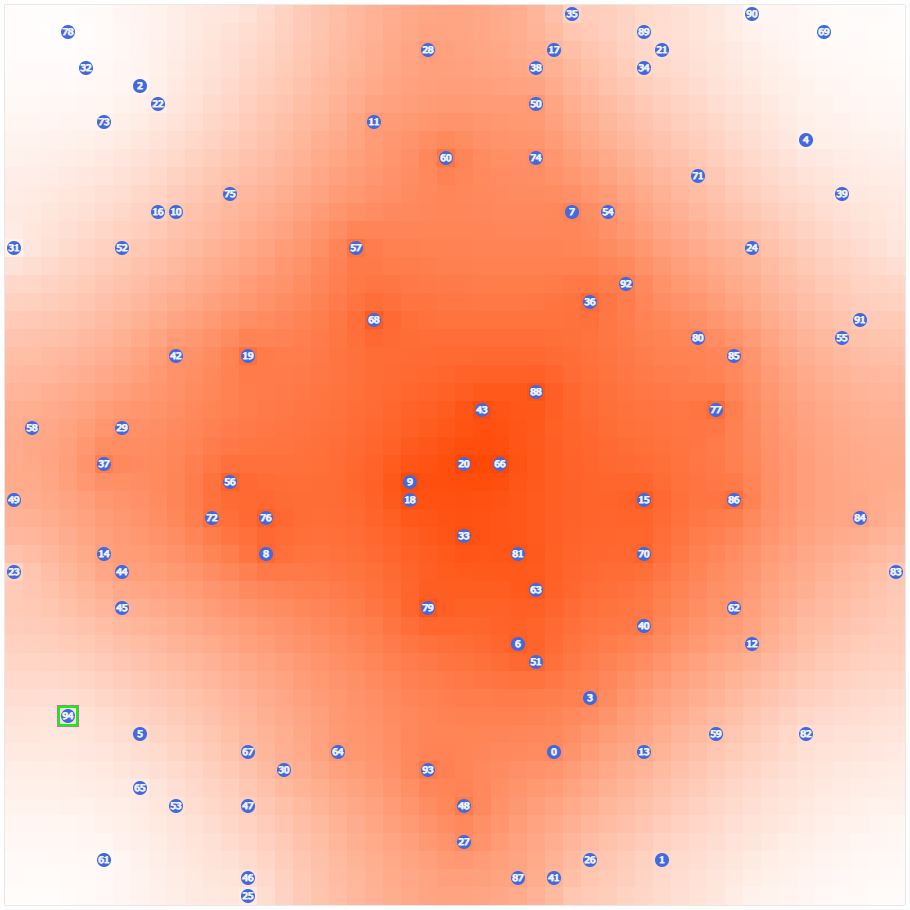
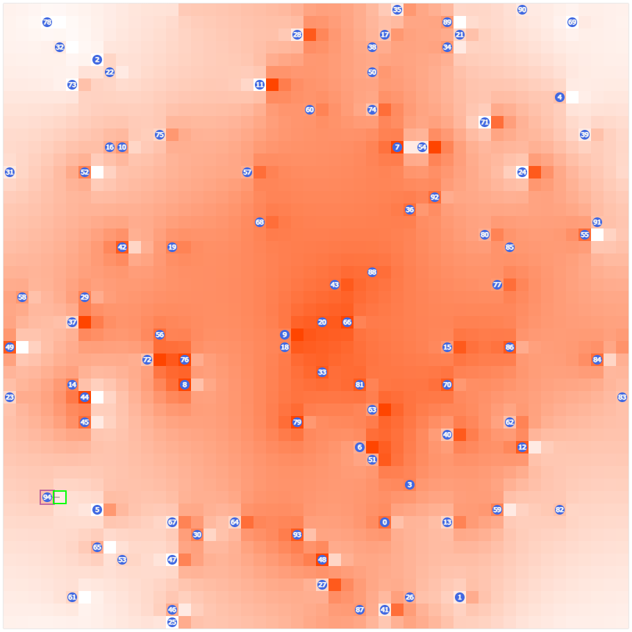

:::note
この記事は 2023年8月20日 に[はてなブログ](https://shogo314.hatenablog.com/entry/2023/08/20/191220)で公開した記事の転載です。
:::

AtCoder Heuristic Contest 022に参加し、442位でした。

## 自己紹介

AtCoderはshogo314でやってます。現在のHeuristicレートは1279です。正直アルゴに比べて苦手意識があります。

## やったこと（時系列）

### 環境整備

多くのテストケースで実行してくれるようにする。

### サンプル

- i番目の出口セルの位置についてPの値を10∗iに、出口セルが存在しない位置は0に設定する
- 各ワームホールについて、y=0,x=0で1回計測し、出口セルの中でPの値が計測値と最も近いものを推定結果として回答する

シードが0~99のときの平均  
Score = 61006.45  
Number of wrong answers = 70.54  
Placement cost = 58216412.0  
Measurement cost = 80050.0  
Measurement count = 80.05

### 計測回数を増やす

とりあえず100回にする。

Score = 193196.03  
Number of wrong answers = 54.96  
Placement cost = 58216412.0  
Measurement cost = 8005000.0  
Measurement count = 8005.0

### 測定しないセルを均す

1. 出口セルがないところについて始め0にする。
2. その場所と上下左右の5つの平均に変更する。
   2の更新を収束するまで繰り返す。高々500回で収束した。  
   この方法は結構悩んで思いついた。

Score = 1043108.47  
Number of wrong answers = 54.96  
Placement cost = 4380140.38  
Measurement cost = 8005000.0  
Measurement count = 8005.0

シード0  


### 出口セルの温度を並び替え

出口セルははじめ、ソートされているためそこそこ綺麗にならんでいるが、最適ではない。

(0,0)に近いセル程温度が小さくなるようにした。

Score = 1273992.77  
Number of wrong answers = 54.87  
Placement cost = 2189832.44  
Measurement cost = 8005000.0  
Measurement count = 8005.0



提出したときの得点が46665734。  
<https://atcoder.jp/contests/ahc022/submissions/44593554>

### 分散ごとに調整

現在、計測コストの方が配置コストより大きいので、不要な計測を減らす。

#### S=1のとき

計測回数1回（シード0~99）  
Score = 46539724.16  
Number of wrong answers = 0.0  
Placement cost = 2184762.94  
Measurement cost = 80050.0  
Measurement count = 80.05

十分余裕がありそうなので出口セルごとの10度の差を狭める

| 差 | 4 | 5 | 6 | 7 | 8 | 9 | 10 |
| --- | --- | --- | --- | --- | --- | --- | --- |
| Score | 58501072.9 | 111642068.92 | 94756777.73 | 83280013.78 | 67687172.44 | 55751381.55 | 46539724.16 |
| Number of wrong answers | 5.62 | 0.97 | 0.52 | 0.04 | 0.01 | 0.0 | 0.0 |

5を採用

Score = 111642068.92  
Number of wrong answers = 0.97  
Placement cost = 606090.1  
Measurement cost = 80050.0  
Measurement count = 80.05

#### S=4のとき

計測回数と差で3分探索  
計測回数10、差7にする

Score = 46035178.9  
Number of wrong answers = 0.69  
Placement cost = 1112203.54  
Measurement cost = 800500.0  
Measurement count = 800.5

#### S=9のとき

計測回数30、差9にする

Score = 21359258.4  
Number of wrong answers = 0.69  
Placement cost = 1785155.8  
Measurement cost = 2401500.0  
Measurement count = 2401.5

#### S=16のとき

差はなるべく大きくなるよう1000/Nとし、計測回数は差が大きいほど小さくなるよう600/(1000/N)とした

Score = 11425781.84  
Number of wrong answers = 1.33  
Placement cost = 3018406.44  
Measurement cost = 4068960.0  
Measurement count = 4068.96

#### S=25のとき

差はなるべく大きくなるよう1000/Nとし、計測回数はmin(10000 / N, 1280 / (1000 / N))とした。

Score = 5487954.38  
Number of wrong answers = 2.92  
Placement cost = 3018406.44  
Measurement cost = 8099700.0  
Measurement count = 8099.7

#### S>=36のとき

差はなるべく大きくなるよう1000/Nとし、計測回数はなるべく大きくなるよう600/(1000/N)とした。

S = 36  
Score = 2139835.28  
Number of wrong answers = 9.35  
Placement cost = 3018406.44  
Measurement cost = 9961740.0  
Measurement count = 9961.74

#### あわせる

シード0~99  
Score = 6659829.24  
Number of wrong answers = 53.56  
Placement cost = 2855445.76  
Measurement cost = 8864140.0  
Measurement count = 8864.14

シードが大きいときはコストが大きいが正答率が上がり、シードが小さいときは正答率をあまり下げずにコストを大きく減らせた。  
提出したときの得点が171125470。ここまで出来たら水perfはありそう。  
<https://atcoder.jp/contests/ahc022/submissions/44599076>

### 出口セルの右側のセルも計測する

出口セルの部分だけを計測する戦略だとそろそろ限界が近い（SだけでなくLやNで場合わけして調節すれば、おそらくもう少しだけ上げられる）。

S=100にして調べる。  
Score = 5161.73  
Number of wrong answers = 45.89  
Placement cost = 3018406.44  
Measurement cost = 9961740.0  
Measurement count = 9961.74

これの改善を目標にする。  
最大100段階にわけるため、差が10しかなく、標準偏差が100もあると100回計測しても区別できなくなってしまうのが問題である。

出口セルの右側のセルにも意味のある数字を設定することにする。  
温度を100段階にわけていたのを右側も含めて10×10段階にする。  
右側に出口セルが既にあり設定出来ない場合は無視する。

S=100  
シード0  
以前  


以後  
Score = 871116.64  
Number of wrong answers = 8.1  
Placement cost = 29694576.56  
Measurement cost = 8405250.0  
Measurement count = 8005.0  


よさげ  
S>=49のときはこちらを採用することにする。

Score = 6862727.85  
Number of wrong answers = 41.5  
Placement cost = 23144140.46  
Measurement cost = 7641190.0  
Measurement count = 7338.94

提出したときの得点が184347800。  
<https://atcoder.jp/contests/ahc022/submissions/44603614>  
おそらくSが大きいときは不十分。

### スコアの期待値を計算したい

正規分布のあたりの知識が欠落しているので実際に確かめながらやってみる。  
正規分布から値をサンプリングする関数はモダンな言語なら大抵用意されている。

#### 正規分布から値をサンプリング

<details>
<summary>コード</summary>

```python
import numpy as np
import matplotlib.pyplot as plt
dataSize = np.int64(1e5)
sigma = np.float64(1)
noise = np.random.normal(0.0, sigma, dataSize)
plt.figure()
plt.hist(noise, bins=100, density=True, color="b")
x = np.arange(-5, 5, 0.01)
gauss = 1/np.sqrt(2*np.pi*sigma**2)*np.exp(-x*x/(2*sigma**2))
plt.plot(x, gauss, "r--")
plt.xlabel('Deviation')
plt.ylabel('Density')
plt.show()
```

</details>
