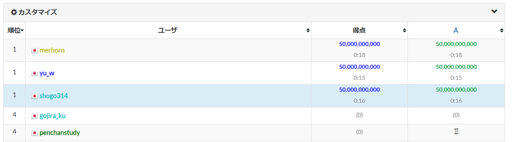
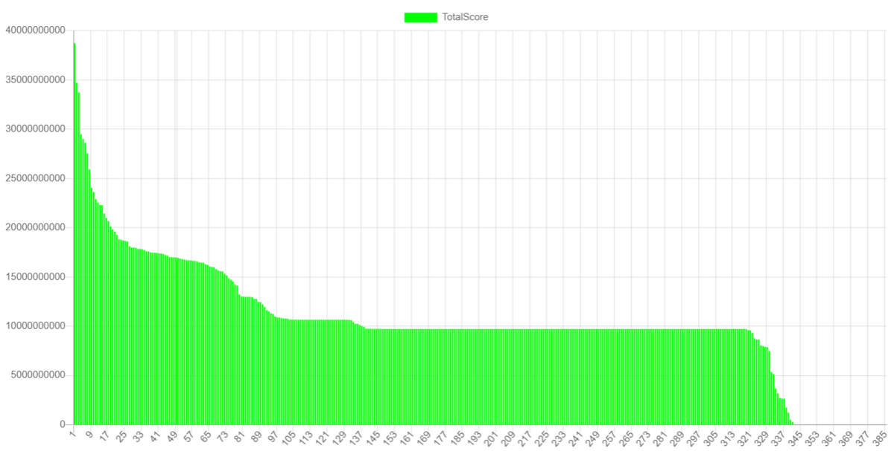

:::note
この記事は 2024年2月19日 に[はてなブログ](https://shogo314.hatenablog.com/entry/2024/02/19/190511)で公開した記事の転載です。
:::

AtCoder Heuristic Contest 030に参加し、275位でした。

## FAチャレンジ

なるべく早くサンプルを提出するチャレンジです。（無意味）

負けました。問題を開くのが少なく見積もって3秒は遅れていたのが敗因です。

## やったこと

### 雛型を作る

サンプルと同じことをするコードを今後の修正を加味しながらきれいに書き直します。この中でコストの計算方法の理解が正しいかなどを確認していきます。

<https://atcoder.jp/contests/ahc030/submissions/50121556>  
絶対スコア：12696000000

$\sum_{t=1}^{50} {N}^2 = 12696$  
であることがわかりますね。

### ランダムにボーリングする

方針が立たないので適当にq1のクエリを繰り返しながら明らかに確定したタイミングで答えを決める形にします。
答えが確定したかを確認するのを O(N2 d M) かけるとして全部で O(N4 d M) 。間に合います。
答えが確定したかは、0の場所と被らずに油田を置けるかの判定を全ての油田について行います。（かなり簡易な判定）

<https://atcoder.jp/contests/ahc030/submissions/50122609>  
絶対スコア：11981000000

微差ですね。

### 判定を賢くする

油田の数が多くなるとほとんど判定が効いていないようです。特定のマスについて、そこに被るように置く方法が1通りであるかの判定を追加します。

<https://atcoder.jp/contests/ahc030/submissions/50123560>  
絶対スコア：10678000000

多くのケースにおいて全て埋めきる前に確定させられるようになりました。
実行時間が1.2sだったので、そろそろ気にする必要がありそうです。

### 順位表を見てみる

(2024-02-10T12:00:00+09:00)

2段になっておりサンプルの上に1段あります。
既にここは超えていますが、見逃している自明解があるようなので、これを探ってみます。

発見しました。サンプルと同じように進めて、見つかっているものの総和を比べると、ここになるようです。

<https://atcoder.jp/contests/ahc030/submissions/50127581>  
絶対スコア：11411000000

### 組み合わせる

稀に全てのセルを探索しているので、組み合わせると改善するはず。

<https://atcoder.jp/contests/ahc030/submissions/50127994>  
絶対スコア：10220000000

### 一次元化する

実行時間を改善するためグリッドを一次元化したりいろいろ工夫します。判定をいろいろ賢くして、まだ調べていない部分も確定する部分をちゃんと記録して、調べるときはそれを除くようにします。
かなり掘る回数を削減できました。

この過程で500回に1回くらいの確率でWAになるバグを見つけました。再現性がないとデバッグで困るのでrandom関数は決定的なものにしておいた方がいい気がします。

<https://atcoder.jp/contests/ahc030/submissions/50255771>  
絶対スコア：5415000000

### 情報量を使う?

掘る場所を改善できる気がします。掘る候補についてそこを掘ったときに得られる情報量を考えて、エントロピーを計算すれば、いい場所を掘るようになりそうです。ただ、実装が面倒だし、TLEになる気もします。

### 同じ形のときがある

同じ形の油田が２つあるとそのどちらなのかが特定できません。このようなケースがだいたい7.5%ほどあります。２つあるなら２択まで絞れた時点でどちらかに決めるような処理を入れました。

### 候補が複数あるものを適当に決めて矛盾があれば候補からはずす

やりすぎるとすぐTLEするので候補が多いものに絞った上で、残り時間が少ないと判定を飛ばすようにした。

### 掘る場所の選び方を工夫する

確定していないものから一様ランダムに選んでいたが、確定している場所の近くは選ばれにくくした。

<https://atcoder.jp/contests/ahc030/submissions/50275514>  
絶対スコア：4957000000

## 感想

結局占いは使えませんでした...
